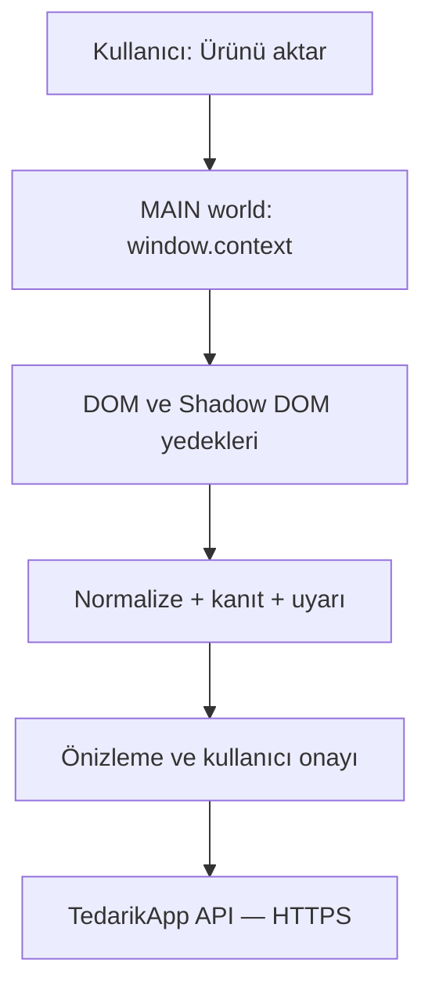

# TedarikApp — 1688 ürün verisi çıkarma ve eklenti geliştirme tavsiye raporu

**İncelenen ürün:** `867966081795`  
**Ürün adresi:** https://detail.1688.com/offer/867966081795.html  
**İnceleme tarihi:** 22 Ağustos 2026  
**Hedef okuyucu:** TedarikApp’i geliştiren Claude / yazılım ekibi  
**Kapsam dışı:** GTİP, TAREKS, gümrük vergisi ve ithalat mevzuatı bu geliştirme fazına eklenmemelidir.

## 1. Yönetici özeti ve net tavsiye

TedarikApp’in 1688 eklentisi, **kullanıcının açıkça “Ürünü TedarikApp’e aktar” eylemiyle çalışan, tek ürünlük ve kanıtlı bir yakalama aracı** olarak kalmalıdır. Arka planda toplu tarama, oturum çerezi kopyalama, MTop imzası üretme veya 1688’in özel API çağrılarını sunucudan tekrar oynatma önerilmez.

En sağlam mimari üç katmandır:

1. **Birincil kaynak — `window.context`:** Başlık, temel fiyatlar, SKU, stok, görseller, kategori, özellikler, satıcı, teslimat ve paket bilgileri.
2. **İkincil kaynak — render edilmiş DOM / Shadow DOM:** Açıklama, ayrıntı görselleri ve sayfada kullanıcıya gösterilen satıcı/yorum/dağıtım sinyalleri.
3. **Son çare — meta etiketleri ve sınırlı DOM seçicileri:** Başlık, ana görsel ve görünen fiyat için yedek.

Bu ürünün HAR kaydı ayrıca 1688’in sayfa açıldıktan sonra kullandığı zengin MTop veri servislerini göstermektedir. Bu servisler alan keşfi ve test fikstürü için değerlidir; ancak **özel ve imzalı uç noktaları eklentinin aktif biçimde yeniden çağırması v1 üretim mimarisi olmamalıdır**. En yasal ve uzun ömürlü yol, ticari kullanım için 1688’den resmî API/yazılı izin edinmektir.

Ana panel sade tutulmalıdır. Kullanıcının ürün seçme kararını etkileyen şu bilgiler görünmelidir:

- normal ve koşullu/promosyonlu fiyat;
- MOQ ve birim;
- varyant, varyant fiyatı, beyan edilen stok ve ağırlık;
- Çin içi çıkış bölgesi ve gönderim taahhüdü;
- satıcı yılı, kalite, 48 saat sevk ve tekrar alış sinyalleri;
- yorum puanı/oranı;
- “fiyat çelişkisi”, “sanal/aşırı stok”, “özel üretim MOQ’su”, “kargo adresi eksik” gibi uyarılar.

Geri kalan ham veriler ana ekranı doldurmamalı; “1688 ayrıntıları” altında açılır bölümde ve denetim kaydında saklanmalıdır.

## 2. İncelemenin kapsamı ve kanıt sınırları

Kullanıcının sağladığı HAR kaydında 75 ağ kaydı vardır. Bunların 29’u `h5api.m.1688.com` MTop çağrısıdır. Kayıt; SKU modeli, mağaza kartı, yorum özeti, yorum listesi, dağıtım performansı, teslim süresi ve benzer ürün verilerini içerir.

HAR, ana HTML dokümanını ve ürün açıklama CDN yanıtını içermemektedir. Bu nedenle aşağıdaki iki grup ayrılmıştır:

- **HAR ile doğrulanan:** Bu rapordaki ürün/SKU/satıcı/yorum/teslimat tablolarının sayısal değerleri.
- **Sayfa yakalamasında ayrıca alınabilecek:** Tam özellik tablosu, açıklama HTML’i, açıklama görselleri, gerçek video dosyası ve bazı SSR alanları.

HAR içindeki oturum çerezleri, MTop imzaları, zaman damgaları, kullanıcı tokenları ve benzeri kimlik doğrulama bilgileri incelenen iş verisine dahil edilmemiş ve bu rapora kopyalanmamıştır.

## 3. İncelenen üründe doğrulanan veriler

### 3.1 Ürün özeti

| Alan | Doğrulanan değer | Kaynak / yorum |
|---|---:|---|
| Ürün ID | `867966081795` | Tüm ürün servisleri |
| Çince başlık | 跨境新款多功能切菜器蔬菜水果切丝切片神器家用厨房刨丝器切丁器 | Benzer ürün karşılaştırma servisindeki güncel ürün |
| Türkçe anlamı | Sınır ötesi yeni çok işlevli sebze/meyve dilimleme, jülyen ve küp doğrama aparatı | Makine çevirisi; ürün adı olarak otomatik onaylanmamalı |
| Ana kategori | 厨房工具 — Mutfak araçları | Mağaza kartı |
| Kategori ID yolu | `201547801 → 122146001 → 122164001` | L1/L2/L3 istek modeli; adları ayrıca SSR’dan alınmalı |
| Malzeme | 不锈钢, ABS — paslanmaz çelik ve ABS | Ürün karar özellikleri |
| Marka | 其他 — Diğer | Ürün karar özellikleri |
| İşlev | 多功能 — Çok işlevli | Ürün karar özellikleri |
| Birim | 个 — adet | SKU ticaret modeli |
| Genel MOQ | 1 adet | SKU ticaret modeli |
| Ürün durumu | Sipariş verilebilir SKU modeli döndü | Tam `PUBLISHED` durumu ana `window.context`ten ayrıca alınmalı |

### 3.2 Fiyat, stok ve satış — önemli çelişkiler

| Alan | Değer | Değerlendirme |
|---|---:|---|
| Standart SKU fiyatı | ¥26,90 | Beş SKU’nun tamamında `price`, `multiPrice` ve `discountPrice` aynı |
| Karşılaştırma kartı fiyatı | ¥24,90 | `新人价` — yeni müşteri fiyatı; koşullu/promosyonlu kabul edilmeli |
| Toplam beyan edilen stok | 3.969.909 | SKU stoklarının toplamı; gerçek fiziksel stok olduğu varsayılmamalı |
| Yapısal satış sayısı | 7.320 | SKU ticaret modeli |
| Pazarlama gösterimi | “20.000+ satıldı” | Karşılaştırma kartı; dönem/kanal farkı olabilir |
| Tek parça ücretsiz kargo | Hayır | `onePieceFreePostage: false` |
| Karışık alım desteği | Evet | `supportMix: true`; ham eşikler `mixAmount: 200`, `mixNumber: 10` |

**Zorunlu veri kuralı:** ¥24,90 ile ¥26,90 aynı alana yazılmamalıdır. `base_price`, `conditional_price`, `price_label` ve `eligibility_unknown` ayrı tutulmalıdır. Satış için de 7.320 ve “20.000+” kaybedilmeden ayrı kaynaklarla saklanmalıdır.

### 3.3 SKU tablosu

Platformdaki SKU ağırlığı bütün varyantlarda `0,66` olarak dönmektedir. 1688’in mevcut modelinde bu alan kilogram cinsinden SKU ağırlığı olarak kullanılır; yine de veri `weight_basis = platform_sku_weight` ve `seller_declared = true` etiketiyle saklanmalıdır.

| SKU ID | Varyantın Türkçe anlamı | Fiyat | Beyan edilen stok | Ağırlık | Özel uyarı |
|---|---|---:|---:|---:|---|
| `5694314108167` | 818 gri-yeşil, 15 parça, soyacak dahil | ¥26,90 | 996.595 | 0,66 kg | — |
| `5694314108166` | 818 siyah kapak, 15 parça, soyacak dahil | ¥26,90 | 992.363 | 0,66 kg | — |
| `5694314108169` | 818 siyah kapak + beyaz, 14 parça | ¥26,90 | 999.837 | 0,66 kg | Set içeriği farklı |
| `5759702100353` | 818 siyah kapak + gri, özel üretim | ¥26,90 | 0 | 0,66 kg | Varyant metninde minimum 2.000 set yazıyor |
| `5694314108171` | 818 beyaz kapak, 15 parça, soyacak dahil | ¥26,90 | 981.114 | 0,66 kg | — |

Her SKU için ayrıca `specId`, varyant görseli ve ham Çince isim mevcuttur. İsim içindeki “2000套起” sadece metin olarak bırakılmamalı; `variant_moq = 2000`, `variant_moq_unit = set`, `custom_order = true` şeklinde ayrıştırılmalı ve kullanıcıya uyarı verilmelidir.

### 3.4 Görseller ve video

- 5 ana ürün görseli doğrulandı.
- 5 varyant görseli doğrulandı.
- Görseller Alibaba CDN üzerinde tam HTTPS adresleriyle bulunmaktadır.
- Ürün yetenek bayraklarında `isSupportVideo: true` vardır; fakat bu HAR’da gerçek video ID’si veya oynatılabilir video URL’si yoktur. **“Video destekleniyor” ile “bu üründe video var” aynı şey değildir.**
- Açıklama görselleri HAR’da yoktur. `window.context…offerDetail.detailUrl` veya render edilmiş açıklama Shadow DOM’u üzerinden ayrıca alınmalıdır.

Görsel saklama önerisi:

- `source_url` aynen saklansın;
- sorgu parametresi ve boyut soneki temizlenmiş `canonical_url` üretilebilsin;
- resim sunucuya hemen kopyalanmasın; kullanıcı ürünü onayladığında indirme/kalıcılaştırma yapılsın;
- görsel sırası ve `main / variant / description` rolü korunmalıdır.

### 3.5 Satıcı ve mağaza güven sinyalleri

| Alan | Değer |
|---|---:|
| Mağaza / şirket | 义乌市世博塑料制品厂 — Yiwu Shibo Plastik Ürünleri Fabrikası |
| Satıcı kullanıcı ID | `2212746937118` |
| Satıcı üye ID | `b2b-2212746937118fdef8` |
| Mağaza adresi | https://shop756o93i956582.1688.com |
| 1688 üyelik yılı | 5 yıl |
| Mağaza yıldızı | 3 |
| Takipçi gösterimi | 4,4 bin |
| Ana kategori | Mutfak araçları |
| Kalite memnuniyeti | %100 |
| Kalite standardını karşılama | %100 |
| 48 saat içinde sevk/alım oranı | %98 |
| Mağaza tekrar alış oranı | %41 |

Bu değerler “satıcı doğrulandı” anlamına gelmez. TedarikApp’te `platform_signal` olarak gösterilmeli; ayrı bir şirket doğrulaması veya fabrika denetimi gibi sunulmamalıdır.

### 3.6 Yorumlar ve sosyal kanıt

| Alan | Değer |
|---|---:|
| Toplam yorum | 8 |
| İyi yorum oranı | %100 |
| Ortalama ürün puanı | 4,6 / 5 |
| Sistem yorumu | 0 |
| HAR’da gelen ayrıntılı yorum | 2 kayıt |

İki ayrıntılı yorumda tarih, kısmen maskelenmiş kullanıcı adı, alıcı seviyesi, satın alınan varyant, adet, puan ve metin bulunmaktadır. Kişisel veri minimizasyonu nedeniyle tam kullanıcı profili veya avatarını TedarikApp’e taşımak gereksizdir. Ürün kararı için yorum metni, puan, tarih, varyant ve görsel sayısı yeterlidir.

`pcOdRateCardInfoMergeService` içindeki önizleme yorumlarının yıldız alanı, özel yorum API’sindeki değerlerle aynı kodlamayı kullanmıyor görünmektedir. Puan için öncelik sırası:

1. özel yorum listesi (`queryitemratedlistv2`);
2. yorum özeti (`querydsrratedatav2`);
3. sayfadaki görünür DOM;
4. önizleme kartı yalnız ham kanıt.

### 3.7 Dağıtım, sevk ve koruma sinyalleri

| Alan | Değer |
|---|---:|
| Çin içi çıkış | 浙江省金华市 — Zhejiang, Jinhua |
| Bölüm kodu | `330782` — Yiwu |
| Gönderim adres kodu | `808230937` |
| Kargo şablonu | `72624750` |
| Resmî lojistik | Hayır |
| 1–2 adet sipariş | 48 saat içinde gönderim taahhüdü |
| 3+ adet sipariş | 20 gün / 480 saat gönderim taahhüdü |
| 24 saat içinde sevk/alım oranı | %51 |
| 48 saat içinde sevk/alım oranı | %98 |
| Son 7 gün dropship adedi | 100’den az |
| Son 30 gün dropship adedi | 100’den az |
| Dağıtıcı sayısı | 5.000+ |
| Dropship kalite standardı | %100 |
| Dropship alıcısının ürünü tutma oranı | %87 |
| Ürün yayın gösterimi | Aralık 2024 |

Dağıtım hizmetinde “resmî iade deposu” ve “geç teslim alma halinde tazminat” bilgileri görülmüştür. Bunlar ürünün Türkiye’ye uluslararası gönderimi değildir; Çin içi/1688 dağıtım hizmeti olarak etiketlenmelidir.

Kargo teklifi servisi hedef adres kodu verilmediği için hata dönmüştür. SKU modelindeki `totalCost: 5` oturum/varsayılan hedef bağlamına bağlı olabilir. Bu nedenle TedarikApp bunu “kesin Çin içi kargo” veya “ürünün toplam maliyeti” olarak kullanmamalıdır.

### 3.8 Platform güven ve tedarik sinyalleri

1688’in platform kartında şu ifadeler döndü:

- kalite problemi yoksa 30 gün iade güvencesi;
- yakın dönemde fiyatın istikrarlı olduğu;
- yakın dönemde stok kesintisi olmadığı;
- normal ve özel fatura desteği;
- yakın dönemde 100+ tekrar sipariş;
- 6.800+ alıcıya hizmet.

Bunlar satıcı tarafından doğrulanmış bağımsız denetim sonucu değil, **platform etiketi**dir. `signal_source = 1688_platform_endorsement`, `captured_at` ve ham Çince ifade ile saklanmalıdır.

`repurchase.access = false` değeri “tekrar alış yok” demek değildir; ilgili tekrar alış ayrıntısına erişim olmadığını ifade eder. Bu alan kullanıcıya olumsuz sinyal olarak gösterilmemelidir.

### 3.9 Pazar karşılaştırması

HAR’da aynı ürün için:

- 9 karşılaştırma adayı;
- 8 “benzer/aynı” ürün;
- satıcının 10 ana önerisi;
- 10 ilişkili öneri;
- öneri kümesi için “toplam 170.000+ satın alma” göstergesi

bulunmuştur.

Bu veri faydalı olsa da ana ürün kaydına karıştırılmamalıdır. İleride “Pazar karşılaştırması” adlı ayrı, isteğe bağlı bir araştırma özelliği olabilir. V1’de kapsam dışı bırakmak uygulamanın sadeliğini korur.

## 4. 1688 sayfasından alınabilecek veri envanteri

| Grup | Alanlar | Birincil kaynak | Güven |
|---|---|---|---|
| Kimlik | offer ID, URL, durum, oluşturma/güncelleme tarihleri | `window.context` | Yüksek |
| Başlık/kategori | Çince başlık, kategori adları ve ID’leri, breadcrumb | `window.context`; DOM yedeği | Yüksek |
| Fiyat | min/max, görüntü fiyatı, kademeler, standart/promosyon/üye/yeni müşteri etiketi | `window.context`; görünen DOM | Yüksek; koşul etiketi zorunlu |
| Ticaret | MOQ, birim, toplam stok, satış, karışık alım, tekli satış | `window.context` | Yüksek; stok “beyan”dır |
| SKU | skuId, specId, eksenler, isim, görsel, fiyat, stok, satış, ağırlık | `window.context`; sayfanın yüklediği SKU modeli | Yüksek |
| Ürün özellikleri | malzeme, marka, model, ölçü, renk, işlev ve kategoriye özgü tüm spec’ler | `featureAttributes` | Yüksek |
| Paket | SKU ağırlığı, parça ağırlığı, uzunluk/genişlik/yükseklik/hacim | `productPackInfo`; `freightInfo` | Orta; sıfır değer “bilinmiyor” olmalı |
| Medya | ana, galeri, varyant, açıklama görselleri; video ID/poster/URL | `window.context`; Shadow DOM | Yüksek/orta |
| Açıklama | HTML, metin, tablo ve açıklama görselleri | `detailUrl`; Shadow DOM | Orta-yüksek |
| Satıcı | şirket, login/member/user ID, mağaza URL, işaretler | `sellerModel`; mağaza kartı | Yüksek |
| Satıcı metrikleri | üyelik yılı, yıldız, takipçi, kalite, sevk, tekrar alış | mağaza kartı / görünür DOM | Orta-yüksek |
| Yorum | ortalama, iyi oranı, toplam, etiketler, metin/tarih/varyant/görsel | yorum özeti / görünür DOM | Orta-yüksek |
| Lojistik | çıkış bölgesi, şablon, adres kodu, ücretsiz kargo, miktara göre sevk süresi | `shippingServices`; `freightInfo` | Yüksek |
| Koruma | iade, gecikme tazminatı, hızlı iade gibi hizmetler | `mainServices`; görünür DOM | Orta-yüksek |
| Dağıtım | dropship desteği, kanallar, performans göstergeleri | consign modeli / görünür DOM | Orta |
| Promosyon | kupon, etkinlik, üye/yeni müşteri fiyatı ve süre | `promotionModel`; DOM | Orta; kişiye bağlı olabilir |
| Pazar araştırması | benzerler, satıcının diğer ürünleri, fiyat/satış kıyası | öneri modülleri | Orta; ayrı özellik olmalı |
| Kanıt | kaynak yolu, yakalama zamanı, parser sürümü, ham değer, güven | eklentinin kendi denetim katmanı | Zorunlu |

## 5. Mevcut TedarikApp parser’ının durumu

İncelenen mevcut kod `window.context → meta → DOM` sırasını kullanmaktadır ve yön olarak doğrudur. Şu alanları zaten taşımaktadır:

- offer ID, URL, yakalama zamanı;
- başlık;
- fiyat/kademe;
- ana görseller;
- video referansı/poster ve DOM’da oynatılabilir URL;
- özellik sözlüğü ve menşe metni;
- MOQ, birim, kategori ve breadcrumb;
- satıcı adı/ID/URL;
- basit SKU isim/fiyat matrisi.

### 5.1 Kritik eksikler

| Öncelik | Eksik | İş etkisi |
|---|---|---|
| P0 | SKU ID, specId, stok, SKU ağırlığı ve varyant görseli | Doğru varyant seçimi ve maliyet hesabı eksik |
| P0 | Temel fiyat ile koşullu fiyatın ayrılması | ¥24,90 / ¥26,90 gibi yanlış maliyet riski |
| P0 | Alan bazlı kaynak ve güven bilgisi | Çelişkiler sessizce eziliyor |
| P0 | Miktara bağlı sevk süresi | 1–2 adette 48 saat, 3+ adette 20 gün farkı kayboluyor |
| P0 | Varyant metninden özel MOQ / özel üretim uyarısı | 2.000 set şartı atlanabilir |
| P1 | Toplam stok, satış, favori, satış dönemi | Ürün canlılığı görülemiyor |
| P1 | Satıcı yıl/puan/kalite/sevk/tekrar alış sinyalleri | Tedarikçi karşılaştırması zayıf |
| P1 | Paket ölçüsü/ağırlık temeli | Kaba navlun hesabı yapılamıyor |
| P1 | Çin içi çıkış ve kargo durumunun açık etiketi | Çin içi kargo, uluslararası kargo sanılabilir |
| P1 | Yorum özeti ve sayısı | Kalite sinyali eksik |
| P2 | Açıklama HTML’i ve detay görselleri | Ürün inceleme kalitesi düşüyor |
| P2 | Koruma ve dağıtım göstergeleri | Risk değerlendirmesi eksik |
| P3 | Benzer ürün araştırması | Faydalı ama ana akış için şart değil |

### 5.2 Şema önerisi

Mevcut `schema_version: 2` hemen kırılmamalıdır. Yeni alanlar önce geriye uyumlu `raw.research` ve `normalized.procurement` bloklarında denenebilir; kararlı hale gelince v3 sözleşmesi çıkarılabilir.

Önerilen kavramsal yapı:

```json
{
  "source": {
    "platform": "1688",
    "external_id": "867966081795",
    "url": "…",
    "captured_at": "ISO-8601",
    "parser_version": "…"
  },
  "normalized": {
    "product": {},
    "pricing": {
      "base": {},
      "conditional": []
    },
    "trade": {},
    "skus": [],
    "shipping": {},
    "seller_signals": {},
    "rating_summary": {},
    "warnings": []
  },
  "evidence": [
    {
      "field": "pricing.base.amount",
      "source_type": "window_context",
      "source_path": "…tradeModel…",
      "raw_value": "26.90",
      "confidence": "high"
    }
  ]
}
```

`evidence` ana ürün tablosunda kolonlara dağıtılmamalıdır; JSONB/ayrı denetim tablosunda tutulabilir. Böylece ana ekran sade kalır.

## 6. Sağlam çıkarma mimarisi

### 6.1 Önerilen akış



1. Yakalama yalnız kullanıcı tıklayınca başlatılmalıdır.
2. MAIN world script `window.context`i okur; sayfa nesnesini değiştirmez.
3. ISOLATED world köprüsü yalnız izin verilen ve küçültülmüş veri sözleşmesini alır.
4. DOM yedekleri semantik `id` ve `data-module` çapalarıyla okunur.
5. Normalizasyon sırasında ham değer silinmez; kaynak yolu ve güven eklenir.
6. Kullanıcı gönderilmeden önce önizleme görür; çelişkiler uyarı olarak gösterilir.
7. Yalnız onaylanan ürün verisi HTTPS ile TedarikApp’e gönderilir.

Chrome’un resmî dokümanı, varsayılan content script’lerin izole dünyada çalıştığını ve sayfanın JavaScript değişkenlerini doğrudan paylaşmadığını açıklar. MAIN world sayfa değişkenlerine erişebilir, fakat sayfa da bu script’e müdahale edebilir; bu nedenle MAIN world’de sadece salt-okunur, küçük ve doğrulanan kod tutulmalıdır: [Chrome content scripts](https://developer.chrome.com/docs/extensions/develop/concepts/content-scripts), [content script manifest seçenekleri](https://developer.chrome.com/docs/extensions/reference/manifest/content-scripts).

### 6.2 Neden `chrome.webRequest` çözüm değildir?

Chrome `webRequest` olayları URL, durum ve header bilgisi verir; Chrome API’si response body’yi parser’a teslim eden bir MV3 mekanizması sunmaz. Ayrıca daha geniş host ve `webRequest` izni Store incelemesini ve kullanıcı güvenini zorlaştırır. Bu nedenle MTop JSON gövdelerini `webRequest` ile yakalama tasarımı önerilmez: [Chrome webRequest API](https://developer.chrome.com/docs/extensions/reference/api/webRequest).

### 6.3 MTop için tavsiye

HAR’da görülen ana servisler:

| Servis | Verdiği iş verisi | Üretim tavsiyesi |
|---|---|---|
| `queryofferskuselectormodel` | SKU, fiyat, stok, ağırlık, ana/varyant görselleri, kargo modeli | Aynı alanları önce `window.context`ten oku; özel çağrı yapma |
| `moga.pc.shopcard` | Mağaza yılı, yıldız, takipçi, kalite, sevk, tekrar alış | Görünür kart/SSR varsa oku |
| `querydsrratedatav2` | Puan ve yorum özeti | Görünür özet/SSR; isteğe bağlı araştırma |
| `queryitemratedlistv2` | Yorum metni, tarih, varyant, puan | V1’de yalnız görünür yorumlar; kişisel veri minimizasyonu |
| `offerPCConsignInfoService` | Dropship performansı ve koruma | Açılır ayrıntı; ana kayda karıştırma |
| `offerLogisticsService` | Miktara göre sevk süresi | Önce SSR; DOM yedeği |
| `NewYxAiIndexPCService` | Fiyat/stok/fatura/itibar platform etiketleri | “Platform sinyali” olarak etiketle |
| `compareOfferSelectListService` | Ürün kartı ve benzer fiyatlar | Ayrı pazar araştırması modülü |
| `offerSimilarSameService` / recommend | Benzer ve satıcı ürünleri | P3, isteğe bağlı |

İstek URL’lerindeki `sign`, timestamp, `_m_h5_tk`, cookie veya diğer oturum değerleri saklanmamalı, loglanmamalı, backend’e gönderilmemeli ve tekrar oynatılmamalıdır. Bunlar kısa ömürlü, kullanıcı oturumuna bağlı ve yetki açısından riskli verilerdir.

## 7. Doğruluk ve çelişki kuralları

1. **Para her zaman string/decimal olarak tutulmalı; floating point kullanılmamalı.** Para birimi CNY olmalıdır.
2. **Koşullu fiyatlar etiketli olmalı.** `新人价`, üye fiyatı, eski müşteri fiyatı ve kupon fiyatı normal satın alma fiyatını ezmemelidir.
3. **Stok “satıcı/platform beyanı”dır.** 999 bin civarındaki değerler fiziksel depo teyidi gibi gösterilmemeli; `declared_stock` ve güven uyarısı kullanılmalıdır.
4. **Ağırlık temeli saklanmalı.** SKU kg alanı ile paket tablosundaki gram alanı birbirine çevrilirken kaynak birim korunmalıdır.
5. **Sıfır ölçü “0 cm” değil “bilinmiyor” olmalıdır.** Satıcının doldurmadığı paket ölçüleri hesaplamaya katılmamalıdır.
6. **SKU ile genel MOQ ayrılmalı.** Bu üründe genel MOQ 1 iken özel varyantın MOQ’su 2.000 settir.
7. **`个` ve `套` ayrımı korunmalı.** Genel ürün birimi “adet”, özel varyant metni “set” diyebilir.
8. **Satış sayıları kaynak ve dönemle birlikte tutulmalı.** 7.320 ve 20.000+ birleştirilmemeli.
9. **Yorum puanı özel yorum kaynağından gelmeli.** Kart içi kodlanmış yıldız alanı doğrudan puan sanılmamalı.
10. **Kargo hedefe bağlıdır.** Hedef adres olmadan ücret kesinleştirilmemeli; sevk süresi ile taşıma süresi ayrılmalıdır.
11. **Türkçe çeviri öneridir.** Çince ham başlık/özellik silinmemeli; kullanıcı onayı olmadan Türkçe alanın üzerine yazılmamalıdır.
12. **Her alanın `captured_at`, `source_path`, `confidence` ve gerekirse `warning` değeri olmalıdır.**

## 8. UI/UX tavsiyesi — uygulamayı karmaşıklaştırmadan

### Ürün yakalama önizlemesi

Üstte yalnız şunlar gösterilmelidir:

- ürün görseli ve Çince/Türkçe başlık;
- standart fiyat ve varsa koşullu fiyat rozeti;
- MOQ, birim, satış ve stok;
- seçilen SKU, SKU ağırlığı ve özel MOQ;
- satıcı için dört kısa sinyal: yıl, kalite, 48 saat oranı, tekrar alış;
- çıkış şehri ve miktara göre sevk süresi;
- kritik uyarılar.

Altında açılır bölümler:

- Varyantlar;
- Satıcı ve yorumlar;
- Lojistik ve koruma;
- Ürün özellikleri;
- Görseller ve açıklama;
- Ham kaynak/kanıt — yalnız yönetici veya hata ayıklama rolü.

### Uyarı örnekleri

- “Yeni müşteri fiyatı: uygunluğunuzu doğrulayın.”
- “Bu varyant özel üretimdir; minimum 2.000 set.”
- “3 adet ve üzeri siparişlerde satıcı 20 güne kadar gönderim süresi bildiriyor.”
- “Stok miktarı platform beyanıdır; sipariş öncesi satıcıdan teyit edin.”
- “Çin içi kargo hedef adres seçilmediği için hesaplanamadı.”

## 9. Hukuk, platform koşulları ve güvenlik

Bu bölüm hukuki görüş değildir; üretime çıkmadan önce Çin e-ticaret/platform sözleşmeleri konusunda hukuk danışmanı değerlendirmesi gerekir.

1688’in 16 Ocak 2026 yürürlük tarihli hukuk bildirimi, izin olmadan robot, crawler, otomasyon, izleme, kopyalama, indirme veya kullanıcı davranışını taklit ederek platform içeriği edinilmesini yasaklayan geniş bir hüküm içerir. Ürün ve mağaza içeriğinin hakları konusunda da ön izin vurgulanır: [1688 hukuk bildirimi](https://terms.alicdn.com/legal-agreement/terms/suit_bu1_b2b/suit_bu1_b2b201802011532_36855.html). Genel hizmet şartları ayrıca platformun çalışmasını etkileyen veya yetkisiz veri elde etmeye yönelik crawler/kodları yasaklar: [Alibaba hizmet şartları](https://terms.alicdn.com/legal-agreement/terms/suit_bu1_b2b/suit_bu1_b2b201703271338_74297.html).

Bu nedenle en sağlam ticari sıra:

1. 1688’den resmî API/iş ortağı erişimi veya yazılı izin araştırılsın;
2. izin netleşene kadar özellik kullanıcı tarafından başlatılan, tek sayfalık, düşük frekanslı ve yalnız şirket içi tedarik amacıyla sınırlandırılsın;
3. toplu tarama, arka plan izleme, CAPTCHA/bot koruması aşma ve özel API replay yapılmasın;
4. görsel/video yeniden yayınlama veya üçüncü kişilere veri satma yapılmasın;
5. satıcı iletişim bilgileri ve alıcı kimlikleri gereksiz yere toplanmasın.

Chrome Web Store tarafında uzantının tek amacı açıkça “kullanıcının seçtiği 1688 ürününü TedarikApp’e aktarmak” olmalıdır. Yalnız gerekli host izni istenmeli, veri türleri ve kullanım amacı ürün içinde açıklanmalı, açık kullanıcı eylemi/izni alınmalı, HTTPS kullanılmalı ve gizlilik politikası yayımlanmalıdır: [Chrome Web Store Limited Use](https://developer.chrome.com/docs/webstore/program-policies/limited-use), [User Data FAQ](https://developer.chrome.com/docs/webstore/program-policies/user-data-faq), [MV3 gereksinimleri](https://developer.chrome.com/docs/webstore/program-policies/mv3-requirements).

## 10. Claude için önerilen geliştirme sırası

### Faz 0 — kapsamı sabitle

- GTİP, TAREKS, gümrük ve mevzuat modüllerini bu işten çıkar.
- Eklentinin tek amacını ürün yakalama ve tedarik listesine aktarma olarak tanımla.
- MTop replay, cookie/token taşıma ve toplu crawling tasarımını reddet.

### Faz 1 — çekirdek veri doğruluğu

- Mevcut `window.context` parser’ını genişlet.
- SKU şemasına `sku_id`, `spec_id`, `image_url`, `declared_stock`, `declared_sold`, `weight_kg`, `weight_basis`, `variant_moq`, `custom_order` ekle.
- Fiyat şemasını `base`, `conditional[]`, `display_label` şeklinde ayır.
- `warnings[]` ve alan bazlı `evidence[]` ekle.
- Miktara bağlı teslim adımlarını normalize et.
- Para, ağırlık, boş/sıfır ölçü ve Çince birim testlerini ekle.

### Faz 2 — sade karar ekranı

- Ürün önizlemesini temel fiyat/MOQ/SKU/ağırlık/satıcı/teslim/uyarı kartlarıyla güncelle.
- Ayrıntıları açılır panellere taşı.
- Kullanıcı SKU seçmeden ürün gönderilecekse bütün SKU’ları sakla; seçilen SKU ayrıca işaretlensin.

### Faz 3 — satıcı ve kalite sinyalleri

- Önce `window.context` ve render edilmiş mağaza/yorum DOM’undan satıcı yılı, kalite, 48 saat oranı, tekrar alış ve yorum özetini al.
- Bu alanları doğrulama değil “1688 platform sinyali” olarak sun.
- Alıcı profil/kimlik verisini toplama.

### Faz 4 — açıklama ve medya

- Açıklama Shadow DOM’unu veya `detailUrl` içeriğini kullanıcı yakalaması sırasında işle.
- Açıklama görsellerini sırayla sınıflandır.
- Video için yalnız gerçek `currentSrc`/geçerli HTTPS medya URL’si varsa oynatılabilir URL kaydet; `isSupportVideo` bayrağından video üretme.

### Faz 5 — test ve gözlem

- Bu HAR’dan yalnız iş verilerini içeren, cookie/header/signature içermeyen sanitize fikstürler üret.
- Parser testlerini bu ürünün beş SKU’su ve aşağıdaki çelişkilerle sabitle.
- Parser başarısızlığını telemetride alan adıyla say; ham sayfa veya kullanıcı verisi gönderme.
- Seçici seti uzaktan veri olarak güncellenebilir; fakat çalıştırılabilir kod/ifade uzaktan indirilmemeli. Chrome MV3, uzaktan yürütülen mantık konusunda kısıtlıdır.

## 11. Kabul kriterleri

Bu ürün sayfasında yeni sürüm başarılı sayılmak için:

1. Offer ID ve başlık doğru olmalı.
2. Beş SKU eksiksiz ve doğru SKU ID ile gelmeli.
3. Her SKU’da ¥26,90, ağırlık 0,66 kg ve doğru stok bulunmalı.
4. Özel varyantta stok 0, özel üretim ve MOQ 2.000 set uyarısı görünmeli.
5. ¥24,90 yalnız “yeni müşteri/koşullu fiyat” olarak görünmeli; temel fiyatı ezmemeli.
6. Genel MOQ 1 ve birim “adet” korunmalı.
7. 1–2 adet için 48 saat, 3+ adet için 20 gün sevk süresi ayrı satırlar olmalı.
8. Satıcı 5 yıl, kalite %100, 48 saat oranı %98 ve tekrar alış %41 doğru gösterilmeli.
9. Yorum özeti 8 yorum, %100 iyi yorum, 4,6 puan olmalı.
10. 7.320 yapısal satış ile “20.000+” pazarlama gösterimi birbirini ezmemeli.
11. Hedef adres yokken Çin içi kargo “kesin” hesaplanmamalı.
12. Hiçbir payload, log veya test fikstüründe cookie, MTop tokenı, `sign`, kullanıcı oturum kimliği ya da imzalı istek URL’si bulunmamalı.

## 12. Bu ürün için regresyon testleri

- `offerId` number gelse bile string olarak saklanır.
- Stok toplamı `3.969.909` olarak hesaplanır; özel varyantın `0` stoku korunur.
- `818黑色盖+灰色—定制款2000套起` metni `custom_order=true` ve `variant_moq=2000` üretir.
- `新人价` etiketi koşullu fiyat sınıfına gider.
- `repurchase.access=false`, `repurchase_rate=0` üretmez.
- `isSupportVideo=true`, `has_video=true` üretmez.
- Kargo servisi `toAddressCode` eksik hatası verdiğinde sonuç “bilinmiyor” olur.
- Yorum önizleme yıldız kodu, özel yorum API puanını ezmez.
- 999 bin seviyesindeki SKU stokları “beyan edilen stok” olarak işaretlenir.
- Satıcı kullanıcı ID ile giriş yapmış alıcı kullanıcı ID birbirine karıştırılmaz.

## 13. Son karar

TedarikApp için en doğru yatırım, GTİP/TAREKS eklemek değil, **1688 ürün yakalamasını güvenilir ve kanıtlı hale getirmektir**. Mevcut parser’ın çekirdeği korunmalı; iş kararına doğrudan katkı veren SKU, ağırlık, özel MOQ, teslimat, satıcı ve yorum alanları eklenmelidir. Ana ekran sade kalmalı; ham veriler, pazar önerileri ve gelişmiş sinyaller açılır bölüm/denetim kaydında tutulmalıdır.

Teknik olarak özel MTop uç noktalarını tekrar çağırmak mümkün görünse de bu, güvenlik, hesap riski, kırılganlık ve platform koşulları açısından en sağlam yol değildir. Üretim hedefi; **kullanıcının açık eylemi + sayfada zaten mevcut veri + minimum izin + kaynak/kanıt + kullanıcı onayı** olmalıdır. Ticari ölçek veya otomasyon istenirse önce resmî 1688 API/yazılı izin yolu tamamlanmalıdır.
