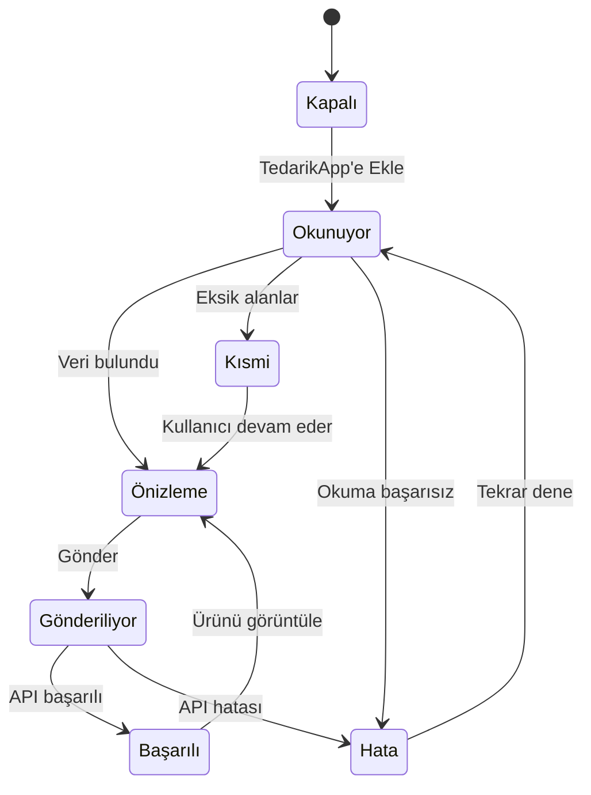

# TedarikApp — 1688 sayfa içi ürün yakalama arayüzü uygulama raporu

**Belge amacı:** Hazırlanan görsel mockup’ın Claude tarafından doğrudan, doğru kapsamla ve mevcut TedarikApp mimarisini bozmadan geliştirilebilmesi.  
**Hedef:** Kullanıcı 1688 ürün sayfasındayken TedarikApp düğmesini görmeli; düğmeye bastığında ürün bilgileri alınmalı, doğrulanmalı, önizlenmeli ve seçilen TedarikApp listesine güvenli biçimde gönderilmelidir.  
**Kapsam dışı:** GTİP, TAREKS, gümrük vergisi, mevzuat ve kesin ithalat maliyeti bu geliştirmeye dahil edilmemelidir.

---

## 1. Claude’a aktarılacak ana fikir

1688 ürün sayfasına, sitenin doğal yapısını bozmayan ve yalnızca ürün detay sayfalarında görünen bir **TedarikApp sayfa içi yakalama arayüzü** eklenmesi tavsiye edilmektedir.

Arayüz iki parçadan oluşmalıdır:

1. Sayfanın sağ alt köşesinde sabit duran küçük **“+ TedarikApp’e Ekle”** düğmesi.
2. Düğmeye basılınca sağdan açılan **ürün yakalama ve önizleme paneli**.

Arayüz 1688’in kendi bileşenlerini değiştirmemeli, gizlememeli veya yeniden biçimlendirmemelidir. TedarikApp bileşeni bağımsız bir katman olarak çalışmalıdır.

Varsayılan akış doğrudan ve kontrolsüz gönderim olmamalıdır. En güvenilir akış:

1. Kullanıcı TedarikApp düğmesine basar.
2. Eklenti ürün verilerini yakalar.
3. Sağ panelde özet, varyant, fiyat ve uyarılar gösterilir.
4. Kullanıcı hedef listeyi ve gerekiyorsa varyantı seçer.
5. “Ürünü TedarikApp’e Gönder” düğmesiyle işlemi onaylar.

Bu iki aşamalı yapı; yanlış varyant, kişiye özel fiyat, özel üretim MOQ’su veya eksik kargo bilgisinin sessizce sisteme aktarılmasını önler.

---

## 2. Kapalı durum: sayfa içi sabit düğme

### Yerleşim

- Masaüstü görünümde ekranın sağ alt köşesinde olmalıdır.
- Önerilen konum: `right: 24px; bottom: 24px`.
- 1688’in sağdaki dikey yardım araçlarıyla çakışırsa konum otomatik olarak içeri kaydırılmalıdır.
- Düğme sayfayla birlikte kaybolmamalı; `position: fixed` kullanılmalıdır.
- Çok yüksek fakat kontrollü bir katman değeri kullanılmalıdır; modal ve tarayıcı arayüzü taklit edilmemelidir.

### Görsel yapı

- Mavi ana renk.
- Beyaz “+” veya TedarikApp simgesi.
- Metin tam olarak: **“TedarikApp’e Ekle”**.
- Yükseklik yaklaşık 40–44 px.
- Yatay iç boşluk 16–18 px.
- Tam yuvarlak/pill görünümü.
- Hafif gölge; aşırı parlama veya animasyon olmamalıdır.

### Etkileşim

- Hover durumunda çok hafif yükselme ve koyulaşma.
- Tıklamada düğme pasifleşip **“Veriler okunuyor…”** durumuna geçmelidir.
- Tekrar tekrar tıklama aynı yakalama işlemini başlatmamalıdır.
- Sayfa ürün detay sayfası değilse düğme gösterilmemelidir.

---

## 3. Açık durum: sağ önizleme paneli

### Boyut ve konum

Önerilen masaüstü değerleri:

```css
width: clamp(390px, 29vw, 460px);
top: 12px;
right: 12px;
bottom: 12px;
position: fixed;
```

- Panel kendi içinde kaydırılmalıdır; 1688 sayfasının scroll davranışı bozulmamalıdır.
- Geniş ekranlarda yaklaşık 430 px hedeflenmelidir.
- 1.000 px’den dar ekranlarda genişlik en fazla `92vw` olmalıdır.
- Panel açıldığında ana ürün görseli mümkün olduğunca görünür kalmalıdır.
- Panel, 1688 içeriğinin sağ kısmını kaplayan bir overlay olmalı; sayfanın kolon ölçülerini değiştirerek layout kaymasına neden olmamalıdır.

### Görsel stil

- Beyaz arka plan.
- 14–16 px köşe yarıçapı.
- Hafif ve doğal gölge.
- İnce açık gri sınır.
- Ana renk: TedarikApp mavisi.
- Başarı: yumuşak yeşil.
- Uyarı: açık amber/sarı.
- Hata: açık kırmızı.
- Yoğunluk: profesyonel ve kompakt SaaS arayüzü.
- 1688’in turuncu renklerini taklit etmemeli; TedarikApp kimliği açıkça ayrılmalıdır.

### Stil izolasyonu

Arayüz, 1688 CSS’i ile karışmaması için ayrı bir Shadow DOM kökü altında oluşturulmalıdır.

Önerilen yapı:

```html
<div id="tedarikapp-extension-host"></div>
  #shadow-root
    <button>…</button>
    <aside role="dialog">…</aside>
```

- Global `body`, `button`, `input`, `img` kuralları yazılmamalıdır.
- 1688’in class adları TedarikApp bileşenlerinde kullanılmamalıdır.
- TedarikApp CSS’i sayfaya global olarak enjekte edilmemelidir.
- UI, ISOLATED content script tarafında oluşturulmalıdır.
- `window.context` okuyan MAIN world script yalnız veri okuyucu olmalı; UI oluşturmamalıdır.

---

## 4. Panelin bölüm sırası ve metinleri

### 4.1 Üst başlık

Sol bölüm:

- TedarikApp logo/simgesi.
- Başlık: **“TedarikApp”**.

Orta veya sağ bölüm:

- Başarılı veri yakalamada yeşil rozet: **“Ürün verileri bulundu”**.

Sağ uç:

- Kapatma düğmesi.
- Erişilebilir etiket: `aria-label="Paneli kapat"`.

Kapatıldığında yakalanan geçici önizleme aynı sayfa açık kaldığı sürece korunabilir. Düğmeye tekrar basıldığında veri değişmediyse yeniden ağ/DOM çalışması yapılması zorunlu değildir.

### 4.2 Ürün önizlemesi

Başlık: **“Ürün önizlemesi”**

İçerik:

- Ana ürün görselinin küçük önizlemesi.
- Türkçe başlık önerisi.
- Çince asıl başlığa ulaşılabilen bir ayrıntı/tooltip.
- Standart fiyat veya fiyat aralığı.
- MOQ.
- Satış göstergesi.

Mockup örneği:

- Ürün: “Destekli kalın tabanlı EVA terlik”
- Fiyat: `¥18,90–¥21,90`
- MOQ: `1 çift`
- Satış: `7.200+ satış`

Türkçe başlık otomatik olarak kesin ürün adı alanına yazılmamalıdır. “Çeviri önerisi” olarak işaretlenmeli ve kullanıcı düzenleyebilmelidir.

### 4.3 Fiyat uyarısı

Koşullu veya kişiye özel fiyat varsa açık amber uyarı kartı gösterilmelidir.

Mockup metni:

> **Koşullu fiyat: ¥15,90 — uygunluğu doğrulayın**

Kurallar:

- Yeni müşteri, üye, kupon, ilk sipariş veya başka şartlı fiyat normal fiyatı ezmemelidir.
- Standart fiyat ve koşullu fiyat ayrı alanlarda tutulmalıdır.
- Koşul bilinmiyorsa `eligibility_unknown: true` üretilmelidir.

### 4.4 Seçilen varyant

Başlık: **“Seçilen varyant”**

Kontroller:

- Renk seçimi.
- Beden/ölçü seçimi.
- Adet seçimi.

Mockup örneği:

- Renk: `Gri`
- Beden: `42/43`
- Adet: `1`

Kurallar:

- Sayfada kullanıcının seçtiği SKU güvenilir biçimde tespit edilebiliyorsa panel onu başlangıç seçimi olarak kullanmalıdır.
- Seçili SKU tespit edilemiyorsa panel “Tüm varyantları aktar” veya “Varyant seç” tercihi göstermelidir.
- Tüm SKU matrisi yine payload içinde korunmalıdır.
- Kullanıcının panelde yaptığı seçim 1688 sepetini veya sayfadaki seçimi değiştirmemelidir.
- Stoku 0 olan varyant seçilebilse bile belirgin “Stok yok” uyarısı verilmelidir.
- Varyant metnindeki özel MOQ veya özel üretim koşulu ayrıca gösterilmelidir.

### 4.5 Yakalanan veriler özeti

Başlık: **“Yakalanan veriler”**

Mockup’taki kompakt satırlar:

- `16 görsel`
- `8 renk`
- `4 beden`
- `Satıcı ve teslimat bilgileri`

Bu bölümün amacı kullanıcıya hangi veri gruplarının bulunduğunu göstermektir. Ham JSON veya teknik alan yolları normal kullanıcıya gösterilmemelidir.

Her satır şu durumlardan birini taşıyabilir:

- bulundu;
- kısmen bulundu;
- bulunamadı;
- doğrulama gerekli.

### 4.6 Satıcı güven özeti

Tek satırlı veya küçük kart halinde gösterilmelidir.

Mockup örneği:

> **13 yıllık satıcı · Kalite %100 · 48 saatte sevk %99**

İsteğe bağlı dördüncü sinyal:

- mağaza tekrar alış oranı.

Bu değerler “TedarikApp doğrulaması” değil, 1688’in gösterdiği platform sinyalleridir. Tooltip:

> “Bu bilgiler 1688 ürün/mağaza sayfasından alınmıştır. Sipariş öncesi satıcıdan teyit edilmelidir.”

### 4.7 Hedef liste

Etiket: **“Hedef liste”**

Dropdown içinde kullanıcının açık/aktif tedarik ve sipariş listeleri gösterilmelidir.

Mockup örneği:

- `2026 Ağustos İthalat Listesi`

Kurallar:

- Son kullanılan açık liste varsayılan seçilebilir.
- Liste seçmeden gönderime izin verilip verilmeyeceği mevcut TedarikApp iş kuralına göre belirlenmelidir.
- Liste API’si yüklenemezse ürün yakalama verisi kaybolmamalı; tekrar deneme sunulmalıdır.

### 4.8 Alt işlemler

İkincil düğme:

> **Önizlemeyi düzenle**

Ana düğme:

> **Ürünü TedarikApp’e Gönder**

Gizlilik notu:

> **Yalnızca seçtiğiniz ürün verileri gönderilir.**

Ana düğme gönderim sırasında:

- pasif hale gelmeli;
- metin “Gönderiliyor…” olmalı;
- ikinci istek oluşmamalıdır.

---

## 5. Arayüz durum makinesi



### Durum metinleri

| Durum | Görünen metin | Kullanıcı işlemi |
|---|---|---|
| Kapalı | TedarikApp’e Ekle | Paneli aç |
| Okunuyor | Veriler okunuyor… | Bekle / iptal |
| Başarılı okuma | Ürün verileri bulundu | İncele ve gönder |
| Kısmi okuma | Bazı bilgiler eksik | Eksikleri gör / devam et |
| Okuma hatası | Ürün verileri alınamadı | Tekrar dene |
| Gönderiliyor | Gönderiliyor… | İşlem kilitli |
| Gönderildi | TedarikApp’e gönderildi | Panelde ürünü aç |
| Mükerrer | Ürün zaten listede | Mevcut kaydı aç / yine ekle |
| Yetki hatası | TedarikApp bağlantısı gerekli | Ayarlara git |
| Sunucu hatası | TedarikApp şu anda yanıt vermiyor | Veriyi koru / tekrar dene |

---

## 6. Teknik sorumlulukların ayrılması

### MAIN world veri okuyucu

Görevleri:

- `window.context` verisini salt okunur biçimde almak;
- gerekli DOM/Shadow DOM alanlarını okumak;
- sayfa URL’si ve seçili SKU bilgisini belirlemek;
- allowlist içindeki alanları ISOLATED köprüye aktarmak.

Yapmaması gerekenler:

- Chrome storage veya TedarikApp tokenına erişmek;
- TedarikApp API’sine istek atmak;
- 1688 sayfasını değiştirmek;
- MTop cookie, token veya imzalarını okumak/taşımak;
- özel MTop isteklerini tekrar oynatmak.

### ISOLATED content script ve Shadow DOM UI

Görevleri:

- sabit düğme ve sağ paneli oluşturmak;
- MAIN world okuyucuyla kontrollü mesajlaşmak;
- alınan veriyi parser’a vermek;
- form, varyant, hedef liste ve önizleme durumlarını yönetmek;
- background service worker ile haberleşmek.

### Background service worker

Görevleri:

- TedarikApp ayar/token bilgisini güvenli storage’dan okumak;
- hedef liste API’sini çağırmak;
- yakalama payload’ını TedarikApp API’sine göndermek;
- HTTP ve kimlik doğrulama hatalarını yapılandırılmış biçimde UI’a döndürmek;
- idempotency/capture ID kullanmak.

---

## 7. Veri yakalama ve gönderim sözleşmesi

Panelin kullanıcıya gösterdiği özet, mevcut yakalama payload’ından türetilmelidir. UI için ayrı ve gerçek veriden kopuk bir model oluşturulmamalıdır.

Önerilen minimum UI modeli:

```ts
interface CapturePreview {
  offerId: string;
  sourceUrl: string;
  imageUrl: string | null;
  originalTitle: string;
  translatedTitleSuggestion: string | null;
  basePrice: { min: string; max: string; currency: 'CNY' } | null;
  conditionalPrices: Array<{
    amount: string;
    label: string;
    eligibilityUnknown: boolean;
  }>;
  moq: number | null;
  unit: string | null;
  soldDisplay: string | null;
  selectedSkuId: string | null;
  skus: SkuPreview[];
  mediaCounts: {
    images: number;
    videos: number;
  };
  sellerSignals: {
    years: number | null;
    qualityRate: string | null;
    dispatch48hRate: string | null;
    repeatRate: string | null;
  };
  shipping: {
    originText: string | null;
    dispatchRules: Array<{ minQty: number; maxQty: number | null; hours: number }>;
  };
  warnings: CaptureWarning[];
}
```

SKU önizleme alanları:

```ts
interface SkuPreview {
  skuId: string;
  specId: string | null;
  label: string;
  attributes: Record<string, string>;
  imageUrl: string | null;
  priceYuan: string | null;
  declaredStock: number | null;
  weightKg: number | null;
  customOrder: boolean;
  variantMoq: number | null;
}
```

Gönderilen asıl capture payload’ı; ham kaynak, normalize veri, parser sürümü, yakalama zamanı ve uyarıları korumalıdır. Önizleme modeli asıl verinin yerine geçmemelidir.

---

## 8. Fiyat ve varyant güvenlik kuralları

1. `新人价`, kupon, üye, eski müşteri veya ilk sipariş fiyatı standart fiyatı ezmemelidir.
2. Panelde koşullu fiyat ayrı amber kartta gösterilmelidir.
3. Ürün fiyat aralığı SKU seçildiğinde SKU fiyatına dönüşebilir; asıl aralık yine payload’da kalmalıdır.
4. Seçili varyant stokta değilse gönderim öncesi uyarı verilmelidir.
5. SKU metnindeki “定制”, “起订”, “2000套起” gibi özel üretim/MOQ ifadeleri uyarı üretmelidir.
6. Çok yüksek stok sayıları “beyan edilen stok” olarak gösterilmelidir.
7. Ağırlık satıcının/platformun beyanıdır; kesin navlun hesabı gibi gösterilmemelidir.
8. Çin içi gönderim süresi, Türkiye’ye teslim süresi olarak etiketlenmemelidir.

---

## 9. Hata ve kenar senaryoları

### Ürün verisi bulunamazsa

- Panel kapanmamalıdır.
- Bulunan temel alanlar gösterilmelidir.
- Eksik alanlar listelenmelidir.
- “Tekrar tara” işlemi sunulmalıdır.
- Kullanıcı isterse yalnız bulunan veriyle devam edebilmelidir; zorunlu alanlar eksikse gönderim engellenmelidir.

### 1688 sayfası sonradan değişirse

- SPA/soft navigation algılanmalıdır.
- URL’deki offer ID değişince önceki geçici önizleme temizlenmelidir.
- MutationObserver tüm sayfayı sürekli taramamalı; yalnız ürün kökü ve URL değişimi izlenmelidir.

### TedarikApp 502 veya ağ hatası verirse

- Yakalanan veri sayfa açık kaldığı sürece bellekte korunmalıdır.
- “Tekrar gönder” sunulmalıdır.
- Aynı kayıt birden fazla kez oluşmaması için `capture_id`/idempotency kullanılmalıdır.
- Kullanıcıya teknik HTML hata sayfası gösterilmemelidir.

### Ürün zaten ekliyse

Panel şu seçenekleri göstermelidir:

- mevcut ürünü aç;
- başka listeye ekle;
- mevcut kaydı güncelle;
- işlemi iptal et.

Varsayılan davranış sessizce mükerrer ürün üretmemelidir.

---

## 10. Erişilebilirlik ve klavye kullanımı

- Panel `role="dialog"` veya uygun tamamlayıcı landmark ile tanımlanmalıdır.
- Açıldığında odak panel başlığına veya ilk anlamlı kontrole taşınmalıdır.
- `Esc` paneli kapatmalıdır; gönderim sürüyorsa önce güvenli iptal davranışı uygulanmalıdır.
- Tab sırası panel içinde mantıklı olmalıdır.
- Panel kapatılınca odak sayfa içi TedarikApp düğmesine dönmelidir.
- Renk tek başına durum göstergesi olmamalıdır; ikon ve metin kullanılmalıdır.
- Metin-kontrast oranları WCAG AA seviyesini hedeflemelidir.
- Yükleme animasyonunda `prefers-reduced-motion` dikkate alınmalıdır.

---

## 11. Performans ilkeleri

- Sayfa açılır açılmaz ağır ürün taraması yapılmamalıdır.
- İlk yüklemede yalnız küçük düğme mount edilmelidir.
- Veri yakalama kullanıcı tıklayınca başlamalıdır.
- Aynı offer ID için sayfa değişmediyse yakalama sonucu kısa süreli cache’lenebilir.
- Açıklama HTML’i ve çok sayıdaki detay görseli, kullanıcı “Ayrıntıları getir” veya gönderim yaptığında işlenebilir.
- Ürün görselleri panelde doğrudan tam boy indirilmemeli; küçük önizleme kullanılmalıdır.
- UI kodu 1688’in ana thread’ini uzun süre bloke etmemelidir.

---

## 12. Güvenlik ve gizlilik

- Eklenti yalnız `https://detail.1688.com/offer/*` sayfalarında çalışmalıdır.
- Host izni mümkün olan en dar kapsamda tutulmalıdır.
- TedarikApp API tokenı MAIN world’e veya sayfa DOM’una aktarılmamalıdır.
- Token yalnız extension storage ve background tarafında kullanılmalıdır.
- Cookie, MTop tokenı, imza, request header veya giriş yapan 1688 kullanıcı kimliği capture payload’ına eklenmemelidir.
- Yorum alıcılarının kimlik/avatar verileri gereksiz yere toplanmamalıdır.
- Gönderim yalnız HTTPS üzerinden yapılmalıdır.
- Panelde “Yalnızca seçtiğiniz ürün verileri gönderilir” açıklaması görünmelidir.

---

## 13. Claude için önerilen geliştirme sırası

### Aşama 1 — UI kabuğu

- Shadow DOM host ekle.
- Sağ alt sabit düğmeyi oluştur.
- Sağ panelin açılma/kapanma davranışını yap.
- 1688 CSS’iyle çakışma ve farklı ekran genişliklerini test et.

### Aşama 2 — mevcut parser bağlantısı

- Düğme tıklamasını mevcut `sayfaVerisiniOku()` ve `parse1688()` akışına bağla.
- Popup ile sayfa içi panelin aynı parser ve aynı selector setini kullanmasını sağla.
- İki ayrı veri çıkarma mantığı oluşturma.

### Aşama 3 — önizleme modeli

- Capture sonucundan `CapturePreview` üret.
- Ürün özeti, fiyat uyarısı, varyantlar, medya sayısı ve satıcı sinyallerini bağla.
- Kısmi veri ve uyarı durumlarını ekle.

### Aşama 4 — hedef liste ve gönderim

- Liste API’sini background üzerinden çağır.
- Son kullanılan listeyi güvenli biçimde hatırla.
- Gönderim, mükerrer kayıt ve idempotency akışlarını tamamla.

### Aşama 5 — kalite

- Klavye/erişilebilirlik.
- SPA URL değişimi.
- 502/ağ hatası ve tekrar gönderim.
- Görsel regresyon testleri.
- Gerçek 1688 fixture ve Playwright E2E testleri.

---

## 14. Kabul kriterleri

1. Düğme yalnız desteklenen 1688 ürün sayfalarında görünür.
2. Düğme sayfanın ana sipariş, sepet ve yardım kontrollerini kapatmaz.
3. İlk tıklama yalnız bir veri yakalama işlemi başlatır.
4. Panel 430 px civarında açılır ve ana ürün görselini tamamen gizlemez.
5. UI, 1688 CSS’inden etkilenmez; 1688 UI’ını etkilemez.
6. Panel gerçek parser sonucunu gösterir; mock/sabit veri içermez.
7. Standart ve koşullu fiyat ayrı görünür.
8. Seçili varyant, tüm SKU matrisi ve stok bilgisi korunur.
9. Hedef liste seçilebilir ve son seçim hatırlanabilir.
10. Gönder düğmesi çift kayıt üretecek şekilde tekrar çalışmaz.
11. Başarılı gönderimde ürün/listenin panel bağlantısı gösterilir.
12. 502 veya bağlantı hatasında yakalanan veri kaybolmaz.
13. Token, cookie, MTop imzası veya oturum bilgisi DOM’a ve payload’a sızmaz.
14. Panel klavyeyle kullanılabilir ve `Esc` ile kapanabilir.
15. URL’de offer ID değiştiğinde önceki ürün önizlemesi temizlenir.
16. GTİP/TAREKS veya gümrük özellikleri bu geliştirmeye eklenmez.

---

## 15. Yapılmaması gerekenler

- Sadece görselde benziyor diye statik/sahte veri kullanmak.
- Popup parser’ından ayrı ikinci bir parser geliştirmek.
- Sayfa açılır açılmaz tüm veriyi ağır biçimde taramak.
- Ürünü kullanıcıya göstermeden otomatik göndermek.
- Koşullu fiyatı normal fiyat olarak kaydetmek.
- 1688 MTop çerez/imza mekanizmasını kopyalamak.
- Global CSS ile 1688 sayfasının tasarımını bozmak.
- Sağ panel açıldığında 1688 ana layout’unu daraltmak veya zıplatmak.
- Kullanıcı gönderime basarken düğmeyi aktif bırakıp çift istek oluşturmak.
- Hata olduğunda yakalanan önizlemeyi silmek.
- Bu küçük özelliğin içine GTİP, TAREKS veya ithalat mevzuatı eklemek.

---

## 16. Son öneri

Mockup’ın ana yaklaşımı korunmalıdır: **küçük sabit düğme + sağdan açılan sade önizleme paneli + kullanıcı onaylı gönderim**.

Bu özellik TedarikApp’in temel amacına doğrudan hizmet eder:

- ürün araştırma süresini azaltır;
- doğru SKU ve fiyatı görünür kılar;
- 1688 ile TedarikApp arasında sekme/popup karmaşasını azaltır;
- kullanıcıya gönderilen veriyi kontrol etme imkânı verir;
- uygulamanın ana panelini gereksiz modüllerle doldurmaz.

Claude geliştirme yaparken mevcut `window.context → meta/DOM fallback → parse1688 → capture API` zincirini korumalı; yalnızca bu zincirin önüne profesyonel sayfa içi UI, sonuna hedef liste ve güvenli gönderim durumlarını eklemelidir.
