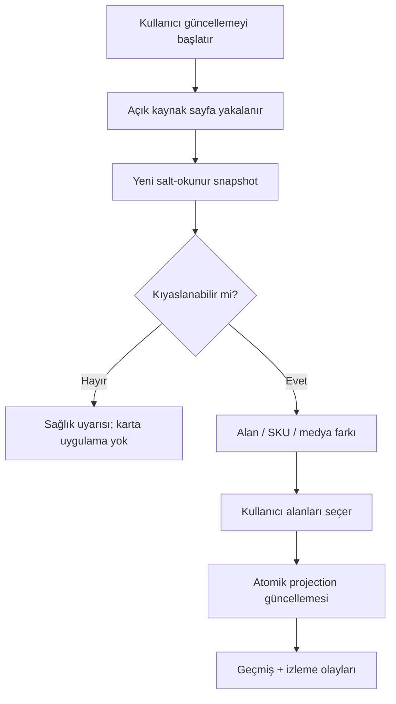

# TedarikApp — “Kaynağından güncelle” şartnamesi

**Durum:** Öneri; uygulama sırası ve fazı PM + Ürün Sahibi kararıdır.  
**Kapsam:** Kullanıcının açık desteklenen ürün detay sayfasında tetiklediği yeniden yakalama, snapshot, fark, onay ve izleme sinyali. Sürekli tarama, zamanlanmış arka plan çekimi, özel MTOP çağrısı ve yorum içeriği kapsam dışıdır.

## 1. Hedef ve değişmez kurallar

“Kaynağından güncelle”, ürün kartını kaynaktaki son görünür ilan verisiyle kör biçimde ezmez. Yeni bir salt-okunur snapshot üretir, eski kabul edilmiş snapshot ile alan alan karşılaştırır ve kullanıcıya uygulanabilir farkları seçtirir.

Bağlayıcı kurallar:

1. Her işlem açık bir kullanıcı hareketiyle başlar.
2. Orijinal kaynak değeri ve geçmiş snapshot asla güncellenmez/silinmez.
3. Kullanıcının çeviri, kategori, not, etiket, miktar, koli içi adet ve diğer manuel/VERIFIED düzeltmeleri otomatik güncellemenin hedefi değildir.
4. Eksik gözlem silme değildir. `auth_hidden`, `not_observed`, `template_unsupported` veya `parse_error` yeni değer olarak karta uygulanamaz.
5. Her kabul/ret append-only değişiklik geçmişine yazılır.
6. Fiyat/stok/ilan sinyalleri aynı karşılaştırma motorundan çıkar; eklenti sürekli izleme yapmaz.
7. Eklenti yalnız kullanıcının açık sayfasındaki görünür DOM, gömülü ürün verisi ve sayfanın kendisinin yüklediği ürün yanıtlarını kullanır. Arka plan `fetch`, çerez okuma, MTOP imza/token üretimi yoktur.

## 2. Tetikler

### 2.1 Ürün kartı düğmesi

- Etiket: **Kaynağından güncelle**.
- Yer: ürün kartı başlığı, kaynak platform rozeti ve “son çekim” damgasının yanında.
- Ön koşul: kartta desteklenen bir `source_listing` ve kanonik URL olmalı.
- Davranış:
  1. Eklenti kurulu/bağlıysa kaynak URL yeni veya mevcut sekmede açılır.
  2. Sekme aktif ve kullanıcı sayfayı görür durumdayken eklentiye tek kullanımlık `refresh_intent_id` verilir.
  3. Sayfa hazır olduğunda kullanıcı eklenti içindeki **Tazele** eylemine basar; sayfa kendiliğinden okunmaz.
- Eklenti yoksa: düğme “Kaynak sayfayı aç” + kurulum/bağlantı açıklaması gösterir; panel sunucusu 1688'i arka planda çekmez.

### 2.2 Eklenti “Tazele” eylemi

- Yalnız desteklenen ürün detay sayfasında etkin.
- Mevcut kart eşleşmesi `(platform, external_id)` ile bulunursa “Bu kayıt güncellenecek” önbilgisi gösterilir.
- Eşleşme yoksa eylem normal “Ürün olarak ekle” akışına döner; yanlış kartı tahmin etmez.
- Kullanıcı tek tıklama sonrası yakalama durumlarını görür: `Sayfa okunuyor → Alanlar doğrulanıyor → Snapshot kaydediliyor → Fark hazırlanıyor`.

### 2.3 İdempotans ve eşzamanlılık

- İstemci her denemeye UUID `capture_id`, panel her niyete UUID `refresh_run_id` üretir.
- Aynı `capture_id` ikinci kez gelirse yeni snapshot oluşturulmaz; önceki sonuç döner.
- Bir listing için aynı anda yalnız bir `capturing` çalışma yürür. İkinci tetik “Güncelleme sürüyor” sonucuna bağlanır.
- Fark ekranı açıldıktan sonra başka bir snapshot kabul edilirse kullanıcıya “Kart bu arada değişti” uyarısı verilir ve fark güncel projection üzerine yeniden tabanlanır; sessiz overwrite yapılmaz.

## 3. Uçtan uca akış



### 3.1 Yeniden yakalama

1. URL ve sayfa tipi adaptörce doğrulanır.
2. İmzalı seçici setinin imzası, sürümü ve platformu doğrulanır. Seçici seti yalnız veri/yol içerir; yürütülebilir uzak kod olamaz.
3. Kaynaklar şu sırayla okunur:
   - gömülü JSON;
   - görünür DOM yedekleri;
   - yalnız sayfanın kendi yüklediği ve ürün kimliğiyle eşleşen MTOP yanıtlarının pasif gözlemi.
4. `buyerModel`, çerez/header/token/imza, `traceId`, SPM/analytics ve kişisel veriler kaynak ağacından teslim yükü oluşturulmadan ayıklanır.
5. RAW alanlar orijinal etiket/değer/path ile; NORMALIZED alanlar standart tip/birimle üretilir. AI çeviri bu yakalama içinde kaynak değer sayılmaz.
6. Alanlar `observed`, `confirmed_absent`, `not_observed`, `auth_hidden`, `template_unsupported` veya `parse_error` olarak sınıflandırılır.

### 3.2 Snapshot oluşturma

Her deneme şu meta veriyi taşır:

- `capture_id`, `listing_id`, `captured_at`;
- `auth_state`, `page_template`, sayfa URL'si;
- eklenti, parser ve seçici seti sürüm/imzası;
- seçilmiş RAW payload hash/ref, NORMALIZED payload;
- gözlenen/beklenen alan sayısı;
- yakalama sağlık puanı ve gerekçeleri;
- önceki kıyaslanabilir snapshot kimliği.

`offer_snapshots` salt okunurdur. Yeni snapshot sağlıksız olsa bile deneme kanıtı olarak `partial`/`failed` kaydedilebilir; fakat karta uygulanamaz ve izleme olayı üretemez.

## 4. Yakalama sağlığı

### 4.1 Beklenen alan profili

Beklenen alanlar tek evrensel liste değildir. Profil şu dörtlüyle seçilir:

`platform + page_template + auth_state + capability_profile`.

Örneğin oturumsuz görünümde `member_price` beklenmez; girişli dağıtım ürününde `consign_metrics` beklenebilir. Böylece “giriş gerektiren alan sessizce eksik” durumu ürünün kendisine ceza yazmaz.

### 4.2 Önerilen puan

| Bileşen | Ağırlık | Ölçüt |
|---|---:|---|
| Kimlik ve sayfa bütünlüğü | %30 | URL ürün kimliği = JSON ürün kimliği; başlık mevcut |
| Ticari çekirdek | %25 | Beklenen fiyat/MOQ/SKU/stok alanlarının kapsaması |
| Ürün içeriği | %20 | özellik, görsel, paketleme ve kategori kapsaması |
| Kaynak güveni | %15 | geçerli seçici imzası, path tipi, parse hatası olmaması |
| Bağlamsal alanlar | %10 | auth profiline göre satıcı/yorum/dağıtım/sertifika |

Kapılar:

- `offerId` eşleşmiyorsa veya başlık yoksa puan ne olursa olsun `failed`;
- fiyat/SKU beklenirken ikisi de gözlenemiyorsa en fazla 69 ve `partial`;
- seçici imzası geçersizse yük reddedilir;
- payload ürün kimliği sayfa URL'siyle uyuşmuyorsa güvenlik olayıdır;
- `auth_state` geriye düştüyse önceki girişli snapshot ile eksik alan kıyaslanmaz.

Önerilen eşikler: `complete ≥ 85`, `partial 50–84`, `failed < 50` veya kapı ihlali. Nihai eşik kabul testleriyle kalibre edilir.

## 5. Fark algoritması

### 5.1 Kıyas çifti

- **Eski:** kartın `latest_accepted_snapshot_id` değeri.
- **Yeni:** bu `refresh_run` tarafından üretilen kıyaslanabilir snapshot.
- İlk yakalamada eski yoktur; bütün gözlenen kaynak alanları `added` sayılır fakat “güncelleme” yerine ilk ekleme akışı kullanılır.
- Snapshot auth/template profilleri uyumsuzsa yalnız iki profilde de güvenle gözlenen alanlar kıyaslanır.

### 5.2 Kanonikleştirme

Farktan önce değerler gösterimden bağımsız hâle getirilir:

- Unicode NFKC, uç boşluk temizliği; kaynak metin saklı kalır.
- Para: decimal string + ISO para birimi. Float kullanılmaz.
- Yüzde: 0–100 decimal.
- Ölçü: mm; ağırlık: g; hacim: CBM. Kaynak birim ayrıca korunur.
- Tarih: kaynak saat dilimi biliniyorsa UTC RFC3339; bilinmiyorsa yalnız tarih/metin ve `timezone_unknown`.
- Anahtar-değer nesneleri anahtara göre sıralanır.
- Küme niteliğindeki listelerde sıra yok sayılır; görsel galerisi, fiyat kademesi ve SKU eksenlerinde sıra anlamlıdır.
- URL'lerde protokol/host küçük harf, izleme sorguları temizlenir; kaynak URL aynen provenance içinde kalır.

### 5.3 Skaler alanlar

Her alan için `(entity_type, entity_key, field_key)` anahtarı kullanılır:

- eski ve yeni gözlendi, kanonik değer farklı → `changed`;
- eski yok/`confirmed_absent`, yeni gözlendi → `added` veya `became_observable`;
- eski gözlendi, yeni açıkça `confirmed_absent` → `removed`;
- yeni `not_observed`, `auth_hidden`, `template_unsupported` veya `parse_error` → **değer farkı değil**, görünürlük uyarısı;
- ikisi eşit → UI'da varsayılan gizli `unchanged`.

### 5.4 Sayısal fark ve yüzde

`absolute_delta = new - old`

`percentage_delta = ((new - old) / abs(old)) × 100`

Kurallar:

- eski değer `0`, yeni değer `0` değilse yüzde `null`, işaret `baseline_zero`;
- para birimleri farklıysa yüzde hesaplanmaz; `currency_changed` yüksek risk farkıdır;
- “100以内”, “7000+” gibi aralık/metin sayıya zorlanmaz; orijinal metin farkı gösterilir, güvenli alt/üst sınır ayrı parse edilebiliyorsa metadata olarak tutulur;
- fiyat kademeleri `source_sku_id + min_qty + price_kind` anahtarıyla kıyaslanır;
- türetilmiş CBM ile kaynak CBM aynı alan değildir; derivation değişimi ayrıca gösterilir.

### 5.5 SKU eşleştirme

Eşleştirme sırası:

1. `source_sku_id` tam eşleşmesi;
2. `source_spec_id` tam eşleşmesi;
3. yalnız kimlik yoksa `stable_signature = sha256(normalized sorted props)`;
4. birden fazla aday varsa otomatik eşleştirme yapılmaz, `ambiguous_sku_match` gösterilir.

Sonuçlar:

- yeni eşleşmeyen SKU → **SKU eklendi**;
- eski eşleşmeyen ve yeni snapshot tüm SKU modülünü sağlıklı gözlemişse → **SKU kaldırıldı**;
- fiyat, stok, ölçü/ağırlık, ad, görsel ve MOQ her SKU altında ayrı farktır;
- SKU adı değişse fakat `sku_id` aynı kalsa ekleme/silme değil alan değişimidir;
- kaynağın SKU kimliğini değiştirdiği şüpheli durumda otomatik sil+ekle kabulü önerilmez.

### 5.6 Görsel ve video

- Görsel kimliği: varsa platform medya ID'si; yoksa temizlenmiş kanonik URL; dosya zaten indirilmişse içerik SHA-256.
- Aynı kimlik farklı sıraya taşındı → `reordered`.
- Yeni kimlik → eklendi; sağlıklı tam galeri yakalamasında kaybolan kimlik → kaldırıldı.
- URL yalnız boyut/lazy suffix değiştirdiyse, içerik hash'i aynıysa değişiklik sayılmaz.
- Video: platform video ID + oynatılabilir URL + poster üçlüsü ayrı alanlardır.
- Blob/data URL kalıcı kaynak değildir; fark ve karta uygulanabilir medya sayılmaz.

### 5.7 Ürün özellikleri ve bilinmeyen alanlar

- Eşleştirme önce `source_attribute_id`, sonra `normalized_key`, sonra `original_label` ile yapılır.
- Aynı normalize anahtara düşen farklı Çince etiketler birleştirilmez; çakışma kullanıcıya ayrı satır gösterilir.
- Değer dizileri sıra-bağımsız küme olarak kıyaslanır; serbest metin kelime kelime otomatik yorumlanmaz.
- Yeni bilinmeyen alan typed şemaya gerek kalmadan `raw_attributes` içinde `added` olarak görünür.

## 6. Fark ekranı

### 6.1 Açılış ve özet

Güncelleme tamamlandığında ürün kartında modal/popup açılır:

- Başlık: **Kaynak değişikliklerini incele**;
- özet: “12 değişiklik · 3 SKU · son çekim 29 Ağu 2026 14:42”;
- sağlık rozeti: Tam / Kısmi / Başarısız;
- giriş durumu: Giriş yapıldı / Giriş yapılmadı / Bilinmiyor;
- eski ve yeni snapshot tarihleri;
- gruplar: Temel, Özellikler, SKU & Paketleme, Satıcı & Sevkiyat, Fiyat & Kampanya, Sertifika & Uyum, Medya.

### 6.2 Fark satırı

Her satır şunları gösterir:

- alanın Türkçe adı ve küçük Çince kaynak etiketi;
- eski değer → yeni değer;
- sayısal alanlarda mutlak ve yüzde değişim;
- kaynak rozeti: JSON / DOM / MTOP;
- ilgili SKU adı/kimliği;
- risk/uyarı: girişsiz yakalama, para birimi değişimi, parser belirsizliği, kullanıcı koruması;
- **Kabul et** / **Reddet** seçimi.

Varsayılanlar:

- Hiçbir değişiklik modal açılır açılmaz uygulanmaz.
- Güvenli ve gözlenen kaynak değişiklikleri `pending` gelir.
- Manuel/VERIFIED korumalı satırlar salt okunur “Kaynak değeri değişti; kart düzeltmeniz korundu” biçimindedir.
- `not_observed` türü satırlarda kabul düğmesi yoktur.
- SKU silme, ilan kapanma, para birimi değişimi, sertifika kaybı ve ana görsel değişimi yüksek risk vurgusu alır.

### 6.3 Toplu işlemler

- **Tümünü kabul et:** yalnız `pending + source_refreshable + observed/confirmed_absent` satırlarını seçer; korumalı ve risk nedeniyle bloklu satırları atlar.
- **Tümünü reddet:** bütün pending farkları reddeder; snapshot yine tarihçede kalır.
- **Seçilenleri uygula:** kabul edilen alanları tek transaction içinde projection'a yazar.
- Başarılı uygulama sonrası sonuç: “9 değişiklik uygulandı · 2 reddedildi · 1 korundu”.

### 6.4 Atomik uygulama

1. Listing projection sürümü yeniden kontrol edilir.
2. Kabul edilen diff satırlarının eski değeri güncel projection ile hâlâ eşleşiyorsa yazılır.
3. SKU/medya/fiyat kademesi ekleme-silme işlemleri aynı transaction içindedir.
4. `latest_accepted_snapshot_id` yalnız transaction sonunda güncellenir.
5. Her karar `change_history` içine yazılır.
6. Çakışmada transaction geri alınır, fark yeniden tabanlanır ve kullanıcıya gösterilir.

## 7. Kullanıcı düzeltmelerini koruma

| Alan / katman | Kaynak yenileme davranışı |
|---|---|
| Orijinal Çince başlık ve kaynak özellik | Yeni snapshot'a eklenir; eski RAW değişmez. Kabul edilirse güncel kaynak projection değişir. |
| Türkçe çeviri / elle ürün adı | Otomatik değişmez. Kaynak başlık değişimi yanında “çeviriyi gözden geçir” önerisi doğabilir. |
| TedarikApp kategorisi | Otomatik değişmez. Kaynak kategori değişimi yalnız öneri/farktır. |
| Not | Hiçbir zaman kaynak farkına konu olmaz. |
| Etiketler | Hiçbir zaman otomatik silinmez/eklenmez; kaynak etiketleri ayrı namespace'tedir. |
| Planlanan miktar | Kaynak MOQ/stok değişse de korunur; uyumsuzluk uyarısı üretilebilir. |
| Koli içi adet / manuel ölçü-ağırlık | Kaynak değer ayrı katmana gelir; kullanıcı değeri korunur. Kullanıcı isterse alan bazında kaynak değeriyle değiştirebilir. |
| VERIFIED sertifika/ölçü/GTİP | Kaynak beyanı bunu ezemez. Çelişki “doğrulanmış değerle uyuşmuyor” olayıdır. |
| AI çıkarımı | RAW üzerine yazılmaz; yeni RAW ile bayat kaldığı işaretlenir ve yeniden üretim ayrı onay ister. |

Görüntüleme önceliği: **VERIFIED → manuel → kabul edilmiş NORMALIZED → RAW → —**. Kullanıcı dilerse alanın provenance çekmecesinde bütün katmanları görür.

## 8. Snapshot ve değişiklik geçmişi

### 8.1 “Değişiklik geçmişi” görünümü

Ürün kartındaki geçmiş sekmesi şunları gösterir:

- çekim tarihi, auth durumu, sağlık, parser/seçici sürümü;
- kaç fark bulundu, kaçı kabul/ret/korundu;
- aktör ve karar zamanı;
- fiyat/stok/SKU/ilan olayı rozetleri;
- snapshot'ı açıp RAW/NORMALIZED/VERIFIED alanlarını provenance ile karşılaştırma;
- kart projection'ını eski kabul kararına geri çevirme.

“Geri çevirme” eski snapshot'ı değiştirmez; yeni bir projection kararı ve change-history satırı üretir.

### 8.2 Saklama

- Snapshotlar ve değişiklik geçmişi iş kayıtlarıdır; varsayılan kalıcı saklama önerilir.
- Aynı payload hash'li snapshot metadata olarak kalır, büyük RAW blob tekilleştirilir.
- Medya binary'si snapshot'a kopyalanmaz.
- Kullanıcı veri silme politikası ayrı genel saklama politikasına tabidir; bu şartname silme süresi belirlemez.

## 9. İzleme sinyalleri

Yalnız iki kıyaslanabilir snapshot arasından üretilir:

| Olay | Koşul | Seviye önerisi |
|---|---|---|
| Fiyat düştü | aynı para biriminde fiyat `<` eski fiyat | bilgi |
| Fiyat arttı | aynı para biriminde fiyat `>` eski fiyat | uyarı; eşik ayarlanabilir |
| Stok bitti | gözlenen stok `>0 → 0` veya kaynak açıkça tükendi | kritik |
| Stok geldi | `0 → >0` | bilgi |
| İlan kapandı | açık kaynak durumu `active → closed/hidden` | kritik |
| İlan yeniden açıldı | `closed/hidden → active` | bilgi |
| SKU eklendi/kaldırıldı | sağlıklı tam SKU kıyası | bilgi/uyarı |
| Kampanya başladı/bitti | zaman/durum geçişi | bilgi |
| Sertifika/uyum beyanı kayboldu | tam sertifika modülünde confirmed_absent | kritik; insan incelemesi |

Bir alanın yalnız görünmez olması olay değildir. İzleme panelde çalışır; eklenti sürekli tarama yapmaz. Yeni sinyal ancak kullanıcı yeniden yakalama yaptığında veya ileride Ürün Sahibi tarafından ayrı, politikalara uygun bir panel izleme kaynağı kararlaştırıldığında doğar.

## 10. API sözleşmesi önerisi

### 10.1 Yakalamayı başlatma niyeti

`POST /api/source-listings/{listing_id}/refresh-intents`

```json
{
  "trigger": "product_card",
  "expected_platform": "1688",
  "expected_external_id": "895133432293"
}
```

Yanıt tek kullanımlık ve kısa süreli `refresh_intent_id` döner. Kimlik oturum çerezi veya kaynak site yetkisi değildir.

### 10.2 Yeni snapshot teslimi

`POST /api/source-listings/{listing_id}/refresh-captures`

```json
{
  "refresh_intent_id": "uuid",
  "capture_id": "uuid",
  "schema_version": 3,
  "extension_version": "2.1.0",
  "parser_version": "1688-2026.08.x",
  "selector_set": {
    "id": "1688-detail-pc",
    "version": "2026.08.29",
    "signature": "base64-signature"
  },
  "source": {
    "platform": "1688",
    "external_id": "895133432293",
    "url": "https://detail.1688.com/offer/895133432293.html",
    "captured_at": "2026-08-29T11:42:00Z",
    "auth_state": "authenticated",
    "page_template": "PC-DEFAULT-2026"
  },
  "raw": {
    "selected_product_payload": {},
    "excluded_data_classes": [
      "buyer",
      "session",
      "analytics",
      "headers"
    ]
  },
  "normalized": {},
  "observations": []
}
```

Sunucu URL/JSON kimlik eşleşmesini, payload boyutunu, seçici imzasını, tipleri ve yasak veri sınıflarını doğrular.

### 10.3 Karar uygulama

`POST /api/source-listings/{listing_id}/refresh-runs/{run_id}/apply`

```json
{
  "projection_version": 17,
  "decisions": [
    { "diff_item_id": "uuid-1", "decision": "accept" },
    { "diff_item_id": "uuid-2", "decision": "reject" }
  ]
}
```

Yanıt uygulanan/reddedilen/korunan/çakışan sayıları ve yeni projection sürümünü döner.

## 11. Hata ve durum kataloğu

| Kod | Kullanıcı mesajı | Sistem davranışı |
|---|---|---|
| `UNSUPPORTED_PAGE` | Desteklenen ürün detay sayfası açık değil. | Yakalama yok. |
| `SOURCE_ID_MISMATCH` | Açık sayfa bu kartla eşleşmiyor. | Güvenlik nedeniyle yük reddi. |
| `LOGIN_LIMITED` | Giriş yapılmadığı için bazı kaynak alanları görülmedi. | Kısmi snapshot; eksikler silinmez. |
| `SELECTOR_SIGNATURE_INVALID` | Kaynak okuyucu doğrulanamadı. | Payload reddi; kart değişmez. |
| `TEMPLATE_UNSUPPORTED` | 1688 sayfa yapısı tanınmadı. | Sağlık 0/failed; parser telemetrisi. |
| `CAPTURE_PARTIAL` | Kaynak verisinin bir bölümü alınamadı. | Fark yalnız güvenli alanlarda. |
| `NO_CHANGES` | Kaynakta uygulanabilir değişiklik bulunamadı. | Snapshot tarihçeye eklenir. |
| `PROJECTION_CONFLICT` | Kart siz incelerken değişti; fark yenilendi. | Rebase, sessiz overwrite yok. |
| `PAYLOAD_TOO_LARGE` | Kaynak ayrıntısı güvenli sınırı aştı. | Parça/alan bazlı reddet; ham HAR kabul etme. |

## 12. Güvenlik ve Chrome Web Store sınırı

- Dar host kapsamı korunur; `<all_urls>` yoktur. Gerekirse yeni platformlar `optional_host_permissions` ile ayrı açılır.
- `activeTab`/kullanıcı hareketi yaklaşımı tercih edilir; mevcut kalıcı `detail.1688.com` host izni son manifest kararıyla tek, açıklanabilir mimariye indirilir.
- Content script güvenilmeyen sayfa girdisiyle çalışır; mesaj şeması, gönderen, URL, boyut ve alan tipleri doğrulanır.
- `MAIN` world yalnız gerekli gömülü sayfa verisini köprülemek için küçük, paket içi ve denetlenebilir kodla kullanılır; asıl iş mantığı isolated world/extension paketindedir.
- İmzalı uzaktan seçici seti yalnız JSONPath/DOM selector/veri eşleme içerir. Koşul dili, eval, regex ile yürütülebilir komut veya uzak script içeremez.
- Web Store açıklaması ve ürün içi bildirim, açık sayfadaki ürün verisinin kullanıcının kendi TedarikApp paneline gönderildiğini açıkça belirtir.
- Kaynak yanıt pasif gözlemi varsa kapsam yalnız beklenen 1688 endpoint + aynı `offerId` + ürün alanı allowlist'iyle sınırlanır; genel ağ trafiği kaydı/HAR üretimi yapılmaz.
- MV3 service worker kalıcı değildir; snapshot teslimi idempotent kuyrukta devam edebilir, işlem global belleğe güvenmez.

Resmî dayanaklar: [kullanıcı gizliliği](https://developer.chrome.com/docs/extensions/develop/security-privacy/user-privacy), [`activeTab`](https://developer.chrome.com/docs/extensions/develop/concepts/activeTab), [izin bildirme](https://developer.chrome.com/docs/extensions/develop/concepts/declare-permissions), [content scripts](https://developer.chrome.com/docs/extensions/develop/concepts/content-scripts), [`chrome.scripting`](https://developer.chrome.com/docs/extensions/reference/api/scripting), [MV3 ek gereksinimleri](https://developer.chrome.com/docs/webstore/program-policies/mv3-requirements), [Limited Use](https://developer.chrome.com/docs/webstore/program-policies/limited-use), [açıklama gereksinimleri](https://developer.chrome.com/docs/webstore/program-policies/disclosure-requirements), [tek amaç SSS](https://developer.chrome.com/docs/webstore/program-policies/quality-guidelines-faq), [service worker yaşam döngüsü](https://developer.chrome.com/docs/extensions/develop/concepts/service-workers/lifecycle) ve [`chrome.storage` kotaları](https://developer.chrome.com/docs/extensions/reference/api/storage).

## 13. Veri hacmi ve performans bütçesi

Önerilen sunucu kabul sınırları kalibrasyon öncesi başlangıç değerleridir:

| Parça | Başlangıç sınırı | Aşım davranışı |
|---|---:|---|
| Sıkıştırılmamış seçilmiş RAW JSON | 2 MiB | Büyük açıklama/media URL listesi ayrı content blob'a |
| `raw_attributes` | 2.000 satır/snapshot | Şablon/loop hatası; capture partial |
| SKU | 5.000/snapshot | Capture partial; kullanıcıya uyarı |
| Medya URL | 1.000/snapshot | Tekilleştir, görünür listeyi koru |
| Açıklama HTML | 5 MiB sanitize öncesi | HTML yerine metin + URL/hash yedeği |
| Eklenti geçici kuyruk | Metadata + sıkıştırılmış payload; medya binary yok | Panel tesliminden sonra temizle |

Bu değerler ürün gerçekleriyle test edilmeden bağlayıcı üretim limiti olmaz. Sunucu tarafı büyük payload'ı sessiz kesmez; hangi grubun alınamadığını sağlık gerekçesine yazar.

## 14. Telemetri ve kabul ölçütleri

Kişisel/oturum verisi içermeyen sayaçlar:

- platform + sayfa şablonu + parser/seçici sürümü;
- alan bazlı `observed/not_observed/parse_error` sayıları;
- capture sağlık bandı ve süre;
- fark türü sayıları;
- payload bayt/SKU/attribute/media sayısı;
- uygulama/ret/çakışma oranı.

Asgari kabul senaryoları:

1. Aynı ilan ikinci yakalamada değişmediyse `NO_CHANGES`, fakat yeni snapshot oluşur.
2. Fiyat `¥48 → ¥44` için `-¥4` ve `-%8,33` doğru hesaplanır.
3. Eski fiyat 0 olduğunda yüzde uydurulmaz.
4. SKU eklendi/silindi/değişti ayrı gösterilir; yeniden sıralama sil+ekle olmaz.
5. Görsel URL suffix'i değişip içerik aynıysa sahte medya değişimi oluşmaz.
6. Girişli → girişsiz yakalamada üye fiyatı/MTOP metrikleri silinmez.
7. Parser hatasında fiyat/stok 0'a düşmez ve izleme olayı doğmaz.
8. Kullanıcı çeviri/kategori/not/etiket/miktar/koli içi adet korunur.
9. VERIFIED sertifika kaynak beyanıyla ezilmez; çelişki gösterilir.
10. “Tümünü kabul et” korumalı ve bloklu farkları atlar.
11. İki eşzamanlı fark uygulamasında projection conflict güvenli rebase üretir.
12. Geçmiş snapshot ve change-history hiçbir kabul/ret işleminde değişmez.
13. Payload'da cookie/token/header/buyer/analytics alanı varsa sunucu reddeder.
14. Eklenti kapalı/arka plandayken 1688 isteği yapılmaz.
15. `—` yalnız null/not-observed gösterir; sıfır gerçek sayı olarak görünür.

## 15. Risk kaydı

| Risk | Belirti | Koruma / tepki | Kalan risk |
|---|---|---|---|
| DOM veya gömülü JSON şeması değişir | Zorunlu alanlar bir anda `not_observed/parse_error`; şablon kimliği değişir | İmzalı sürümlü seçici seti, fixture kapısı, şablon profili, alan telemetrisi, başarısız yakalamada kartı değiştirmeme | Yeni şablon ilk görüldüğünde manuel seçici/doğrulama turu gerekir. |
| MTOP endpoint/yanıt yapısı değişir | Yorum/satıcı/dağıtım/sertifika alanları kaybolur | MTOP'u yalnız pasif ve allowlist alanlarda kullanma; çekirdek kartı JSON/DOM ile çalışır tutma; eksikleri silme saymama | MTOP-only sinyaller geçici olarak kullanılamaz. |
| Giriş gerektiren alanlar sessiz eksilir | Önceki girişli değerin yeni girişsiz snapshot'ta görünmemesi | `auth_state` + beklenen alan profili + `auth_hidden`; uyumsuz profillerde kaldırma olayı üretmeme | 1688 giriş durumunu açıkça bildirmeyen A/B şablonunda `unknown` kalabilir. |
| Gömülü veri bayat/kirli olur | DOM/MTOP ile fiyat, stok veya rating çelişir | Kaynak önceliğini alan bazında tanımlama; rating için MTOP özeti; provenance ve çelişki bayrağı | Platformun kendisi tutarsız değer gösterebilir; kullanıcı onayı gereklidir. |
| Chrome Web Store “aşırı izin / tarama” değerlendirmesi | İncelemede geniş host veya web etkinliği sorusu | Kullanıcı tetiklemesi, dar host/`activeTab`, açık ürün içi bildirim, arka plan fetch/HAR yok, uzaktan yürütülebilir kod yok | Pasif MTOP gözlemi ayrı Store/mahremiyet kabul turu isteyebilir. |
| Seçici JSON uzaktan kod gibi yorumlanır | MV3 remote hosted code reddi | Sadece selector/path/deklaratif eşleme; eval/koşul dili/komut yok; şema + imza + boyut allowlist'i | Aşırı karmaşık selector DSL'si eklenirse yeniden risk doğar. |
| Veri hacmi büyür | Büyük SKU/özellik/açıklama payload'ı, eklenti kotası | Medya binary'si yok; sanitize açıklama blob'u; hash tekilleştirme; sunucu limitleri; eklentide yalnız geçici kuyruk | Uç kategori ürünleri için limit kalibrasyonu gerekir. |
| Yanlış SKU eşleşmesi | SKU silindi/eklendi gibi sahte fark | `sku_id → spec_id → stable_signature`; belirsizlikte otomatik eşleştirmeme | Platform SKU kimliğini topluca yenilerse kullanıcı incelemesi gerekir. |
| Kullanıcı/VERIFIED alanı ezilir | Çeviri, kategori, miktar veya doğrulanmış belge değişir | Katman önceliği, protection policy, atomik diff uygulaması, append-only geçmiş | Yanlış protection metadata migration testiyle yakalanmalıdır. |
| Kısmi yakalama stok bitti/ilan kapandı olayı üretir | Yanlış kritik bildirim | Olay yalnız comparable snapshot + `observed/confirmed_absent` koşuluyla; sağlık kapıları | Platform açıkça yanlış durum döndürürse insan incelemesi gerekir. |

## 16. PM + Ürün Sahibi karar noktaları

1. Bu özellik Eklenti 2.1 içinde mi, V3-E/F izleme temeliyle birlikte mi uygulanacak?
2. Snapshot saklama süresi kalıcı mı, sıcak/soğuk katmanlı mı olacak?
3. “Tümünü kabul et” varsayılan olarak bütün güvenli farkları mı, yalnız seçili grubu mu kapsayacak?
4. Fiyat artış bildirim eşiği ve sertifika kaybı seviyesi nedir?
5. Kaynak açıklama HTML'i tam sanitize metin olarak mı, yalnız görsel/URL dizini olarak mı saklanacak?
6. Girişli MTOP pasif gözlemi Store incelemesine girmeden önce ayrı politika/mahremiyet kabul turu gerektirir mi?

## 17. İlgili dosyalar

- [1688 veri envanteri](1688-veri-envanteri.md)
- [Ürün veri şeması](urun-veri-semasi.json)
- [Kaynak Verisi sekmesi mockup](kaynak-verisi-sekmesi-mockup.html)
- [RAW / NORMALIZED / PROVENANCE veri modeli](../../../../v2/02-veri-modeli.md)
- [Görev #19 platform veri-kanalı raporu](../../v3-e/gorev-19/platform-veri-kanali-raporu.md)
- [Chrome Web Store politika teyidi](../../store-politika-teyidi.md)
